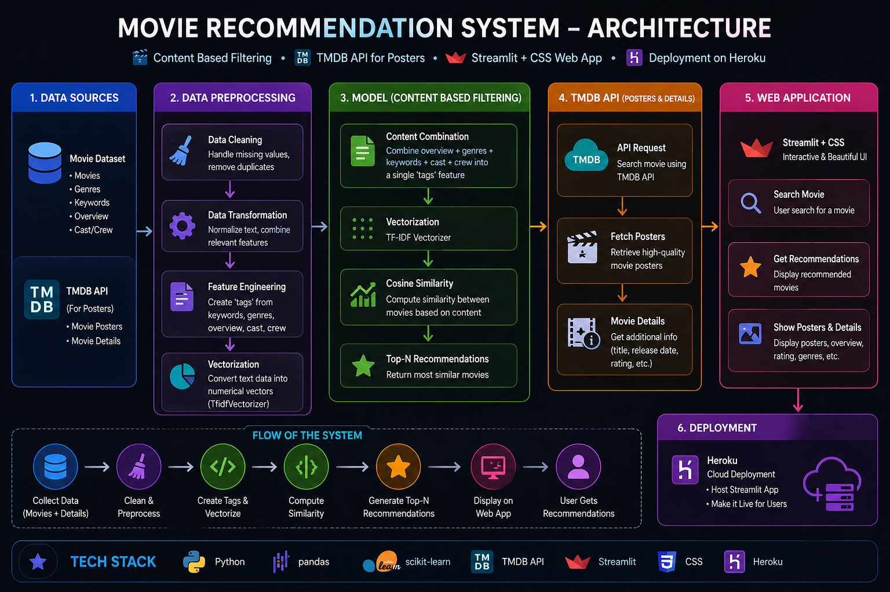

# 🎬 CineMatch — AI-Powered Movie Recommender

> A content-based movie recommendation system built with Python, scikit-learn, and Streamlit — styled like Netflix.

[](https://python.org)
[](https://streamlit.io)
[](https://scikit-learn.org)
[](https://www.themoviedb.org/)

---

## 🔗 Live Demo

---

## 📸 Screenshots

> _(Add screenshots of your app here once deployed)_

---

## 📖 Overview

CineMatch is a **content-based filtering** movie recommendation engine trained on the TMDB 5000 dataset. It recommends the 5 most similar movies to any title the user selects, using NLP techniques to build a rich "tag" representation of each film — then ranking them by cosine similarity.

The frontend is a polished Streamlit app with a dark Netflix-style UI, hero banners, animated movie cards, and live poster/metadata fetched from the TMDB API.

---

## 🏗️ Architecture


## ⚙️ How It Works

### 1. Data Preprocessing (`Movie_Recommendation_system.ipynb`)

- Merges `tmdb_5000_movies.csv` and `tmdb_5000_credits.csv` on movie title
- Extracts and parses: `genres`, `keywords`, top-3 `cast` members, and `director`
- Splits `overview` into word tokens
- Collapses multi-word names (e.g. `Sam Mendes` → `SamMendes`) to prevent false matches
- Concatenates all fields into a unified `tags` column per movie

### 2. NLP & Vectorisation

- Applies **lemmatization** (WordNetLemmatizer) to normalize word forms
- Vectorizes tags using **CountVectorizer** with `max_features=5000` and English stop-word removal
- Computes a **cosine similarity matrix** across all ~4800 movies

### 3. Serialization

- Saves `movies.pkl` (DataFrame: `movie_id`, `title`, `tags`)
- Saves `similarity.pkl` (4800×4800 similarity matrix)

### 4. Streamlit App (`app.py`)

- Loads pickled artifacts at startup
- On user input, looks up the movie index and sorts similarity scores
- Fetches live poster, backdrop, rating, genres, and overview from the **TMDB API**
- Renders a Netflix-style hero banner for the selected movie and a 5-card grid of recommendations

---

## 🗂️ Project Structure

```
cinematch/
│
├── Movie_Recommendation_system.ipynb   # Data processing & model training
├── app.py                              # Streamlit web application
│
├── tmdb_5000_movies.csv                # Raw dataset (download separately)
├── tmdb_5000_credits.csv               # Raw dataset (download separately)
│
├── movies.pkl                          # Serialized movie DataFrame (generated)
├── similarity.pkl                      # Serialized cosine similarity matrix (generated)
│
└── requirements.txt                    # Python dependencies
```

---

## 🚀 Getting Started

### Prerequisites

- Python 3.8+
- A free [TMDB API key](https://www.themoviedb.org/settings/api)

### 1. Clone the repository

```bash
git clone https://github.com/your-username/cinematch.git
cd cinematch
```

### 2. Install dependencies

```bash
pip install -r requirements.txt
```

### 3. Download the dataset

Download the TMDB 5000 dataset from [Kaggle](https://www.kaggle.com/datasets/tmdb/tmdb-movie-metadata) and place both CSVs in the project root:
- `tmdb_5000_movies.csv`
- `tmdb_5000_credits.csv`

### 4. Run the notebook

Open and run all cells in `Movie_Recommendation_system.ipynb`. This will generate:
- `movies.pkl`
- `similarity.pkl`

### 5. (Optional) Set your TMDB API key

Open `app.py` and replace the key in `get_api_key()` with your own:

```python
def get_api_key():
    return "YOUR_TMDB_API_KEY_HERE"
```

> ⚠️ For production, use environment variables or Streamlit secrets instead of hardcoding.

### 6. Launch the app

```bash
streamlit run app.py
```

The app will open at `http://localhost:8501`.

---

## 📦 Requirements

```
streamlit
pandas
numpy
scikit-learn
nltk
requests
pickle5
```

> Run `pip install -r requirements.txt` to install all at once.

---

## ☁️ Deployment


---

## 🔑 API Reference

This project uses the [TMDB API v3](https://developer.themoviedb.org/docs) for:

| Endpoint | Usage |
|----------|-------|
| `GET /movie/{movie_id}` | Poster, backdrop, overview, rating, genres, release date |

---

## 📊 Dataset

- **Source:** [TMDB 5000 Movie Dataset](https://www.kaggle.com/datasets/tmdb/tmdb-movie-metadata) on Kaggle
- **Size:** ~4,800 movies
- **Fields used:** title, overview, genres, keywords, cast, crew

---

## 🧠 Model Details

| Component | Detail |
|-----------|--------|
| Approach | Content-based filtering |
| Vectorizer | `CountVectorizer` (bag-of-words, 5000 features) |
| Text normalization | WordNetLemmatizer (NLTK) |
| Similarity metric | Cosine similarity |
| Recommendations | Top 5 most similar movies |

---

## 🙏 Acknowledgements

- [TMDB](https://www.themoviedb.org/) for the movie data and API
- [Streamlit](https://streamlit.io/) for the web framework
- [scikit-learn](https://scikit-learn.org/) for vectorization and similarity computation
- Dataset sourced from [Kaggle](https://www.kaggle.com/)

---

## 📄 License

This project is open-source and available under the [MIT License](LICENSE).

---

<p align="center">Built with ♥ using Streamlit · Powered by TMDB API · CineMatch © 2025</p>

